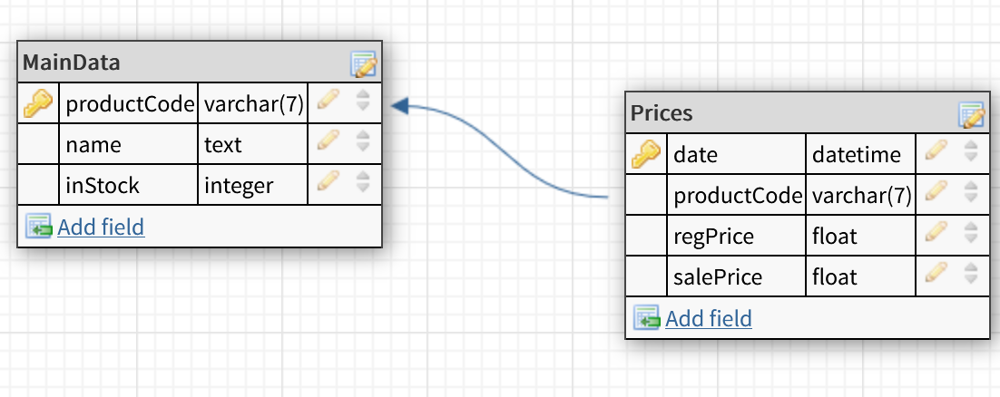

# Overview
This program has been created for a family member to webscrape their competitor's product details from their website using the python requests library, store any changes or new products in an sqlite database, and then report these changes to the user through GUI. It may be a bit rough in areas.

# Details

## Database
This program uses a simple sqlite database to store products, it follows the following schema:

## Graphical User Interface
The GUI of this program is created through PyQt5 with some basic stylesheets.

## Graphical Interface
Placeholder

## Web Scraper
Placeholder

# To be Added in v1.1
- Use an .ini file to store file directories, usernames and passwords, etc
- List changes in stock status in changelog
- Email all new changelog through a gmail account
- Maybe implement a product search / show data page
